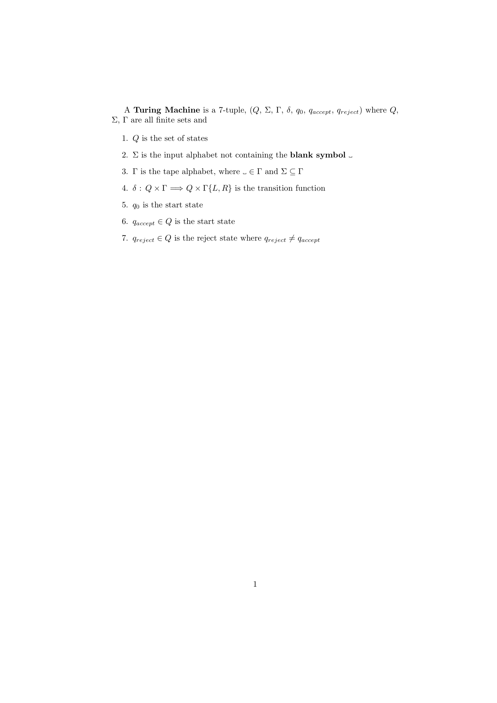

# Quantum Turing Machine in Verilog

In short, Quantum Turing Machines model the processes used in Quantum Computers.

This project is a simulation of a Quantum Turing Machine written in Verilog, an industry recognized tool for circuit design.

## Table of Contents

- [How to run the simulation](#Running-the-simulation)
- [Quick Guide](#Quick-Guide)
- [Classical Turing Machines](#Classical-Turing-Machines)
- [Quantum Turing Machines](#Quantum-Turing-Machines)
- [Design Strategy](#Design-Strategy)
- [Implementation Details](#Implementation-Details)
- [References](#References)

### Running the simulation

Use a dektop verilog tool to run `main.v` or an [online compiler](https://www.tutorialspoint.com/compile_verilog_online.php) by copying `main_online.v` into the compiler.

### Classical Turing Machines

- [Brief Overview](#Brief-Overview)
- [Mathematical Description](#Mathematical-Description)
- [Types of Classical Turing Machines](#Types-Of-Classical-Turing-Machines)

#### Brief Overview

A classical Turing Machine represents a theoretical model for how computer processes should function. In practice, they are applied to circuit deisgn to contruct computers as well as study, from a theoretical standpoint, the problems that can and cannot be solved by a computer.

In short, a Turing machine is represented as a tape, divided into cells, that can hold symbols. We describe how processes modelled by a Turing Machine evolve over time by a set of states, that must start at some state. The set of states must also include states that represent accepting criteria and states that represent rejection criteria. The accepting criteria and rejection criteria must never be the same. In the simplest model of a Turing Machine, when transitioning from one state to another, the machine can choose to write a symbol to the current tape cell and then move left or right along the tape. In other variants of Turing Machines, the transition 'actions' can include many other actions, instead of just writing to or erasing the current cell and moving left or right along the tape.

#### Mathematical Description

Sipser(140)

#### Types of Classical Turing Machines

### Quantum Turing Machines

- [Brief Overview](#Brief-Overview)
- [Mathematical Description](#Mathematical-Description)
- [Types of Quantum Turing Machines](#Types-Of-Quantum-Turing-Machines)

#### Brief Overview

#### Mathematical Description

#### Types of Quantum Turing Machines

### Design Strategy

### Implementation Details

### References

- Sipser, Michael. "Introduction to the Theory of Computation." ACM Sigact News 27.1 (1996): 27-29.
- Kime, Charles R., and M. Morris Mano. Logic and computer design fundamentals. Prentice Hall, 2003.
